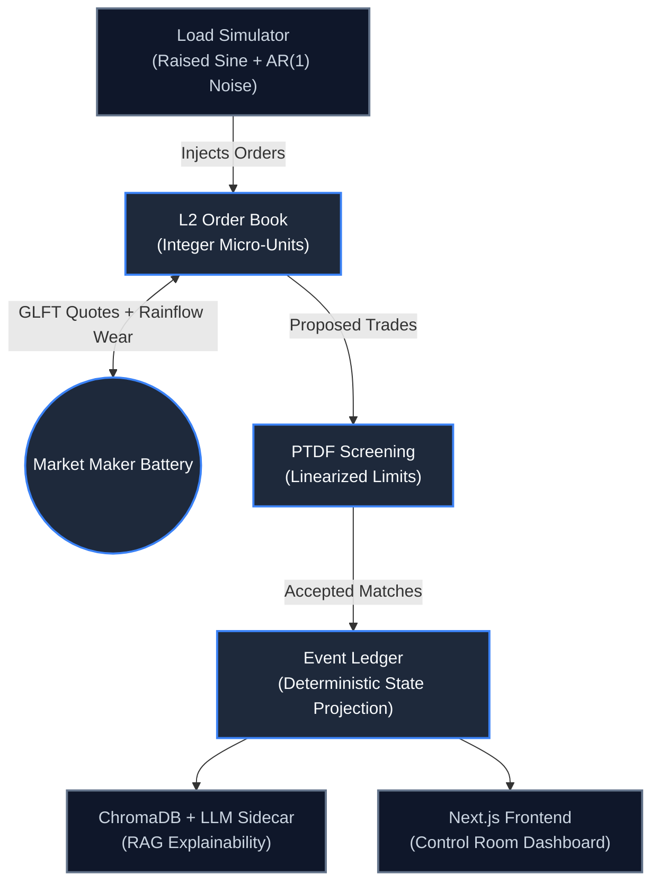

<div align="center">
  <h1 align="center">Sovereign-AMM</h1>
  <p align="center">
    <strong>Deterministic HFT Market Microstructure & Quantitative Energy Matching Engine</strong>
  </p>
  <p align="center">
    
    
    
    
  </p>
  <p align="center">
    <a href="#architecture"><strong>[ Architecture ]</strong></a> &nbsp;&nbsp;|&nbsp;&nbsp;
    <a href="#core-mathematics"><strong>[ Core Math ]</strong></a> &nbsp;&nbsp;|&nbsp;&nbsp;
    <a href="#feature-grid"><strong>[ Features ]</strong></a> &nbsp;&nbsp;|&nbsp;&nbsp;
    <a href="#quickstart"><strong>[ Quickstart ]</strong></a>
  </p>
</div>

<br/>

## The System

**Sovereign-AMM** is a deterministic energy matching engine that treats a physical microgrid as a high-frequency financial exchange. By employing rigorous mathematical models, the system eschews non-deterministic predictive AI in favor of robust market microstructure principles. 

In this exchange, households and solar producers post bids and asks for energy (kWh) into an **L2 limit order book**. A central grid battery acts as the algorithmic market maker, continuously quoting a two-sided price utilizing the **Gueant-Lehalle-Fernandez-Tapia (GLFT)** bounded-inventory model, critically augmented with dynamic **Rainflow fatigue costs** to account for physical battery degradation.

**Thesis**: Uncompromising grid stability is achieved through deterministic market microstructure and strict physics constraints.

---

<h2 id="architecture">Architecture</h2>

The system leverages an event-sourced ledger and strict constraint screening to maintain perfect state determinism and O(1) matching efficiency.



---

<h2 id="core-mathematics">Core Mathematics & Microstructure</h2>

Sovereign-AMM strictly adheres to mathematical rigor. Core components include:

- **GLFT Pricing Model**: The market maker computes optimal bid-ask spreads dynamically based on inventory levels, shielding against inventory risk while maintaining liquidity.
- **Rainflow Cycle Counting**: Physical battery degradation is priced into the spread using a streaming 3-point cycle counting algorithm. Every reversal and closed cycle contributes directly to marginal wear cost ($C_{deg}$).
- **Power Transfer Distribution Factors (PTDF)**: Trades are validated against physical transmission limits in sub-milliseconds, ensuring that localized matching never violates global grid constraints.
- **Micro-price Referencing**: The mid-price is dynamically adjusted based on order book imbalance, providing a more accurate reference price for the market maker.

---

<h2 id="feature-grid">Feature Grid</h2>

<table width="100%">
  <thead>
    <tr>
      <th align="left">Feature</th>
      <th align="center">Status</th>
      <th align="left">Implementation Notes</th>
    </tr>
  </thead>
  <tbody>
    <tr>
      <td><strong>L2 Order Book</strong></td>
      <td align="center">🟢 LIVE</td>
      <td>Integer micro-units, O(1) best bid/ask matching engine.</td>
    </tr>
    <tr>
      <td><strong>GLFT Pricing</strong></td>
      <td align="center">🟢 LIVE</td>
      <td>Bounded inventory [0, Q_max] asymptotic quoting.</td>
    </tr>
    <tr>
      <td><strong>Rainflow Wear</strong></td>
      <td align="center">🟢 LIVE</td>
      <td>Streaming 3-point cycle counting folded into the Ask.</td>
    </tr>
    <tr>
      <td><strong>PTDF Screening</strong></td>
      <td align="center">🟢 LIVE</td>
      <td>Linearized line limits, evaluated in sub-ms latency.</td>
    </tr>
    <tr>
      <td><strong>Event Ledger</strong></td>
      <td align="center">🟢 LIVE</td>
      <td>100% deterministic state projection (event-sourced).</td>
    </tr>
    <tr>
      <td><strong>Load Simulator</strong></td>
      <td align="center">🟢 LIVE</td>
      <td>Raised sine wave with AR(1) autoregressive noise.</td>
    </tr>
    <tr>
      <td><strong>UI Dashboard</strong></td>
      <td align="center">🟢 LIVE</td>
      <td>Next.js App Router providing real-time 10Hz updates.</td>
    </tr>
    <tr>
      <td><strong>RAG Sidecar</strong></td>
      <td align="center">🟢 LIVE</td>
      <td>ChromaDB + LLM explainability for order execution.</td>
    </tr>
    <tr>
      <td><strong>Zero-Knowledge</strong></td>
      <td align="center">🟡 STUBBED</td>
      <td>Pedersen commitments / Bulletproofs (ADR 002).</td>
    </tr>
    <tr>
      <td><strong>Full DC-OPF</strong></td>
      <td align="center">🟡 STUBBED</td>
      <td>LP solver formulation (ADR 003).</td>
    </tr>
    <tr>
      <td><strong>VPIN/GARCH</strong></td>
      <td align="center">🟡 STUBBED</td>
      <td>Advanced risk metrics & volatility forecasting.</td>
    </tr>
  </tbody>
</table>

---

<h2 id="quickstart">Quickstart</h2>

Get the engine running in local development mode:

```bash
# 1. Setup python environment and install dependencies
make install

# 2. Run the deterministic test suite
make test

# 3. Start the services (Backend, Frontend, Chroma)
make dev

# 4. Run the seeded demo scenario in a separate terminal
make demo
```

> **Note**: The engine strictly enforces pure math in `engine/core`. No floating point operations for ledger accounting, and no network/I/O calls within the matching logic.
