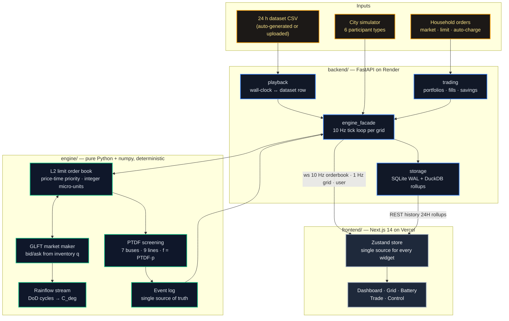

<div align="center">

<h1>⚡ Sovereign-AMM</h1>

<p><strong>A deterministic, physics-aware energy exchange for microgrids — where the community battery is the market maker.</strong></p>

<p>
  <a href="https://sovereign-amm-git-main-riturajbarman.vercel.app/dashboard"></a>
  <a href="https://sovereign-amm-backend.onrender.com/docs"></a>
  <a href="docs/PRODUCT_GUIDE.md"></a>
</p>

<p>
  
  
  
  
  
  
  
  
</p>

<p>
  <a href="#-what-it-does">What it does</a> ·
  <a href="#-live-demo">Live demo</a> ·
  <a href="#-architecture">Architecture</a> ·
  <a href="#-the-mathematics">Mathematics</a> ·
  <a href="#-features">Features</a> ·
  <a href="#-api--streams">API</a> ·
  <a href="#-quickstart">Quickstart</a> ·
  <a href="#-deployment">Deployment</a> ·
  <a href="#-testing">Testing</a>
</p>


</div>

---

## 🧭 What it does

Sovereign-AMM treats a physical microgrid — 100 homes, rooftop solar, EV chargers and a **5 MWh community battery** — as a **high-frequency limit-order-book exchange**.

- Households, solar farms and the utility post **bids and asks for kWh** into an L2 order book that updates **10 times per second**.
- The central battery is the **algorithmic market maker**. It quotes a two-sided price with the **GLFT bounded-inventory model** and folds **Rainflow battery-wear cost** into its ask — so it never runs empty, never over-fills, and never sells its own lifetime for free.
- Every match is **screened against grid physics (PTDF)** before it executes: a trade that would overload a line is rejected, and congestion shows up as **locational marginal prices** per bus.
- The whole town is driven by a **24-hour dataset synchronised to the wall clock** — at 08:00 IST the engine streams the 08:00 row — and **any signed-in household can trade** against the battery from the terminal.

> **Thesis:** grid stability and fair local prices come from *deterministic market microstructure + hard physics constraints*, not from predictive black boxes. Every price on screen is a formula with visible inputs.

---

### RAG Copilot

`/copilot` (and the floating ✨ drawer on every page) is a retrieval-augmented Lead Microgrid Quant Analyst. Answers fuse a structured knowledge base (7-bus topology, GLFT / OBI / LMP math, Rainflow degradation, platform guides) with the live 10 Hz engine snapshot (micro-price, spread, OBI, SoC, $C_{deg}$, PTDF line loading) and render Markdown + KaTeX with source attribution.

| Endpoint | Purpose |
|---|---|
| `POST /api/rag/query` | `{query, include_live_telemetry}` → `{answer, sources, suggested_followups, telemetry}` |
| `POST /api/rag/stream` | Same input, Server-Sent Events (`meta` → `delta`… → `done`) |
| `GET /api/rag/questions` | Predefined question chips by pillar |

Set `ANTHROPIC_API_KEY` (or `OPENAI_API_KEY`) on the backend to generate with an LLM; without a key the copilot returns deterministic, retrieval-grounded answers so the feature works on every deploy.

## 🚀 Live demo

| | URL |
|---|---|
| **Frontend** | https://sovereign-amm-git-main-riturajbarman.vercel.app |
| **Backend / OpenAPI** | https://sovereign-amm-backend.onrender.com/docs |
| **Health** | https://sovereign-amm-backend.onrender.com/health |

The site opens in the **Demo Sandbox** — fully unlocked for anonymous visitors: every chart, dial, slider and order form is interactive on the 24 h DuckDB demo stream, with a local **₹1,00,000 paper wallet** (trades execute against the in-browser L2 book). Signing in (Google or password) switches to your authenticated **live** WebSocket feed and your persisted wallet; admin e-mails (`ADMIN_EMAILS`) additionally unlock the **Control Room**.

> The backend runs on Render's free tier and sleeps after 15 minutes of inactivity. The first request takes ~30–60 s; the dashboards show `SIMULATED` (an in-browser fallback) until the engine wakes, then flip to `LIVE · 10 Hz` automatically.

<details>
<summary><strong>More screenshots</strong></summary>
<br/>

**Grid — PTDF topology, LMP shadow costs, 9 × 7 PTDF matrix**


**Battery — Rainflow DoD histogram, GLFT inventory boundaries, live risk parameters**


**Trade — household order desk against the Central Power Control hub**


</details>

---

## 🏗 Architecture



**Design rules that make it trustworthy**

| Rule | Why |
|---|---|
| `engine/` is pure maths — numpy only, no I/O, no network, no unseeded randomness | Testable in isolation; identical results on every run |
| State lives in an **event log**; the book and battery are projections | Replay the log → identical state (proven in tests) |
| Money and energy are **integer micro-units** (1 = 1e‑6 kWh / 1e‑6 INR) | No floating-point drift in the ledger |
| **One engine loop per grid**, WebSocket clients only read snapshots | Any number of viewers, zero effect on the deterministic path |
| Trades are **PTDF-screened before** they reach the ledger | Physics is a hard constraint, not a KPI |

---

## 📐 The mathematics

<table>
<tr><th align="left">Component</th><th align="left">Formula</th><th align="left">Role</th></tr>
<tr>
<td><strong>Micro-price</strong></td>
<td><code>micro = (P_bid·V_ask + P_ask·V_bid) / (V_bid + V_ask)</code></td>
<td>Volume-weighted reference price (Stoikov), EWMA-filtered at 10 Hz</td>
</tr>
<tr>
<td><strong>GLFT quotes</strong><br/><sub>Guéant–Lehalle–Fernandez-Tapia</sub></td>
<td>
<code>q = 2(soc − Q/2)/Q ∈ [−1, 1]</code><br/>
<code>base = (1/k)·ln(1 + k/γ)</code><br/>
<code>spread = √( σ²γ/(2kA) · (1+γ/k)^(1+k/γ) )</code><br/>
<code>bid = mid − [base + ((2q+1)/2)·spread]</code><br/>
<code>ask = mid + [base − ((2q−1)/2)·spread] + C_deg</code>
</td>
<td>Inventory-skewed two-sided quote; hard walls suppress the bid at the SoC ceiling and the ask at the floor</td>
</tr>
<tr>
<td><strong>Rainflow wear</strong><br/><sub>ASTM E1049, Wöhler curve</sub></td>
<td>
<code>N(d) = N₀·d^(−β)</code><br/>
<code>C_deg(d) = C_capex / (2·N(d)·E_nom·η)</code>
</td>
<td>Streaming 3-point cycle extraction; marginal cost of the dominant open excursion is added to the ask</td>
</tr>
<tr>
<td><strong>PTDF screening</strong><br/><sub>DC power flow</sub></td>
<td>
<code>PTDF = (B_d·A_inc)·pinv(B_bus)</code>, slack column zeroed<br/>
<code>f = PTDF·p_inj</code><br/>
reject if <code>∃l: |f_l + (PTDF[l,i] − PTDF[l,j])·ΔP| > f_max,l · margin</code>
</td>
<td>O(L) congestion check per fill; makers that fail are parked for that taker, not dropped</td>
</tr>
<tr>
<td><strong>LMP decomposition</strong></td>
<td><code>LMP_i = λ_energy + λ_loss,i − Σ_l PTDF[l,i]·μ_l·sign(f_l)</code></td>
<td>Shadow price μ_l ramps once a line exceeds 80 % loading</td>
</tr>
</table>

Full derivations: [`docs/math_spec.md`](docs/math_spec.md) · design decisions: [`docs/adr/`](docs/adr/)

---

## ✨ Features

| Area | What you get |
|---|---|
| **Trading Dashboard** | 12 × 12 L2 depth with the AMM's own levels marked, micro-price / OBI / spread tiles, 24 h price-and-SoC chart (DuckDB 1-minute rollups over 86,400 ticks with live ticks appended), radial SoC and OBI gauges, AMM P&L (realised, unrealised, wear cost, position), engine fill tape |
| **Grid Topology** | 7-bus / 9-line SVG with flow-direction animation; emerald → amber (> 80 %) → pulsing red (> 95 %); node injection override (−5…+5 MW); LMP table with congestion decomposition and binding-line shadow prices; full 9 × 7 PTDF matrix with live `f / f_max` |
| **Battery Market Maker** | Rainflow DoD histogram (engine-computed, hydrated from history), GLFT reservation curves over q ∈ [−1, 1] with floor/ceiling bands, live σ / γ / k / A, δ_bid / δ_ask, throughput and average spread; sliders push γ and σ to the engine |
| **Clock-synced playback** | `POST /api/simulation/upload-csv` ingests `timestamp, bus_id, house_count, solar_mw, demand_mw, micro_price, battery_soc_pct, grid_frequency_hz`; the engine matches `T_now = h·3600 + m·60 + s` (IST) to the nearest 10 s row and drives demand, solar, price, nodal injections, grid frequency and hub dispatch. A generated 8,640-row sample day is activated on startup |
| **Household terminal** | Market (IOC), limit (resting, cancellable) and **auto-charge** orders ("buy 10 kWh when the ask ≤ ₹4.50") routed into the same book; wallet, inventory, avg cost, realised / unrealised PnL and **savings vs utility tariff**; fills pushed on `/ws/user/{id}` |
| **Control Room** | Order desk, topology + injections, day profile with a NOW marker, dataset upload with progress, scenario buttons (load spike, solar surplus, low battery, congestion), JSON / CSV dataset injection |
| **Dual-state auth (RBAC)** | Anonymous = Demo Sandbox (24 h rollups + demo tick stream, no sockets, local ₹1,00,000 paper wallet, local PTDF injections and GLFT sliders — nothing locked); signed-in = live feed + persisted paper trading (SQLite `users`/`trades`); `role=admin` JWTs (from `ADMIN_EMAILS`) unlock `/control`, dataset feed upload, live injections, scenarios and the emergency kill-switch — enforced server-side by `require_user` / `require_admin` |
| **Resilience** | Offline fallback to a seeded in-browser simulation (`SIMULATED` badge), WebSocket back-off reconnects, server-side disconnect handling, bounded book and event log |

---

## 🔌 API & streams

| Endpoint | Rate / type | Payload |
|---|---|---|
| `ws://…/ws/orderbook/{grid}` | 10 Hz | depth, micro-price, OBI, spread, tape, AMM quotes, SoC, q, C_deg, PnL, synced clock |
| `ws://…/ws/grid/{grid}` | 1 Hz | 9 line flows + status, LMP rows, PTDF matrix, battery analytics (rainflow, risk, GLFT breakdown), playback status |
| `ws://…/ws/user/{user_id}` | on change | household portfolio, open orders, fills |
| `GET /history/{grid}?window=1H\|4H\|24H\|ALL` | REST | raw ticks (1H/4H) or 1-minute DuckDB rollups (24H/ALL); `/history/export/{grid}` streams CSV |
| `POST /api/simulation/upload-csv` · `GET /api/simulation/status` · `/profile` · `/runs` | REST | dataset playback control |
| `POST /api/trading/orders` · `DELETE /api/trading/orders/{id}` · `GET /api/trading/portfolio` | REST | household trading |
| `POST /api/control/inject` · `/inject/csv` | REST | inject ticks, orders, bus injections, SoC, parameters |
| `POST /grid/{grid}/inject` · `/reset` · `PUT /grid/{grid}/parameters` | REST | power control and GLFT parameters |
| `POST /api/demo/trigger/{scenario}` · `POST /api/emergency/toggle` | REST | scripted scenarios, kill-switch |
| `POST /api/auth/demo` · `/google` · `/login` · `GET /api/auth/me` | REST | guest session, OAuth, password auth |

Interactive docs: `/docs` on the backend.

---

## 🛠 Quickstart

**Prerequisites:** Python 3.11+ (3.12 recommended), Node 20+.

```bash
git clone https://github.com/riturajbarman/sovereign-amm.git
cd sovereign-amm

# 1. Dependencies (engine + API + frontend)
make install

# 2. Seed 24 h of tick history (86,400 rows) and generate the playback dataset
make seed
make dataset

# 3. Backend — FastAPI + 10 Hz engine on :8000 (run from the repo root)
make backend

# 4. Frontend — Next.js on :3000 (in another terminal)
make frontend
```

Open http://localhost:3000/dashboard — you land in Demo Mode with the engine streaming.

<details>
<summary><strong>Environment variables</strong></summary>

**Backend** (`.env` or host settings)

| Variable | Default | Purpose |
|---|---|---|
| `ALLOWED_ORIGINS` | `http://localhost:3000,…` | CORS allow-list (every `*.vercel.app` origin is also accepted) |
| `JWT_SECRET` | dev value | Sign JWTs — change in production |
| `PUBLIC_DEMO` | `false` | Allow anonymous WebSocket streams (off = strict dual-state; REST history stays public) |
| `ADMIN_EMAILS` | — | Comma-separated e-mails that receive `role=admin` on sign-in |
| `DEMO_GRID_ID` | `demo` | Grid started at boot |
| `SIM_TIMEZONE` | `Asia/Kolkata` | Wall clock used for dataset playback |
| `AUTO_SAMPLE_DATASET` | `true` | Generate + activate the sample day when no run is active |
| `GOOGLE_CLIENT_ID` | — | Verify Google ID tokens against your client |
| `DATABASE_PATH` | `backend/app/db/sovereign.db` | SQLite file |

**Frontend** (`frontend/.env.local`)

| Variable | Example |
|---|---|
| `NEXT_PUBLIC_API_URL` | `http://localhost:8000` |
| `NEXT_PUBLIC_WS_URL` | `ws://localhost:8000` (derived from the API URL if omitted) |
| `NEXT_PUBLIC_GRID_ID` | `demo` |
| `NEXT_PUBLIC_AUTO_DEMO` | `true` |
| `NEXT_PUBLIC_GOOGLE_CLIENT_ID` | your OAuth client id |

</details>

<details>
<summary><strong>Docker</strong></summary>

```bash
make dev   # docker compose up --build → backend :8000, frontend :3000, redis, chroma
```

</details>

---

## ☁️ Deployment

| Service | Host | Notes |
|---|---|---|
| Backend | **Render** (web service, repo root) | Build: `pip install -r backend/requirements.txt` · Start: `python simulation/seed_history.py && python -m uvicorn backend.app.main:app --host 0.0.0.0 --port $PORT` · `PYTHON_VERSION=3.12.4` |
| Frontend | **Vercel** (root directory `frontend`) | Set the `NEXT_PUBLIC_*` variables above and redeploy — they are compiled into the bundle |

Render's disk is ephemeral: history and the sample dataset are regenerated on every boot (~1 s); uploaded datasets and portfolios persist until the next deploy.

---

## 🧪 Testing

```bash
make test            # 58 pytest cases — engine maths, API, WebSockets, DuckDB rollups, playback, trading
make test-frontend   # 953 vitest cases — store, validators, mapping, components
cd frontend && npm run build   # strict TypeScript, zero errors
```

What the suites guarantee:

- GLFT quotes never cross, respect SoC walls, and are monotone in q (property-based with Hypothesis)
- Rainflow cost is monotone in depth; the DoD histogram sums correctly
- PTDF rejects overloads before the ledger append; `f = PTDF·p` holds for every streamed frame
- Event-log replay reproduces live state exactly
- Clock matcher maps 08:00:00 → the 08:00 row, 14:44:06 → 14:44:10, and wraps at midnight
- Market / limit / auto-charge orders update wallets, inventory and savings; guards reject overspend

---

## 🗂 Repository layout

```
engine/            pure-math core: order book, GLFT, rainflow, PTDF, event log
backend/app/       FastAPI: engine_facade (10 Hz loop), playback, trading, storage, api/*
simulation/        city simulator, 24 h history seeder, dataset generator, sample CSV
frontend/          Next.js 14 app: lib/store.ts (Zustand), components/, app/(dashboard)/*
tests/             pytest suites (core/, events/, api/)
docs/              PRODUCT_GUIDE.md (plain-English walkthrough), math_spec.md, adr/, screenshots/
```

---

## 📚 Further reading

- **[Product Guide](docs/PRODUCT_GUIDE.md)** — every page and every box explained in plain English, with a demo script
- **[Math specification](docs/math_spec.md)** — symbol tables and derivations
- **Architecture decision records** — [GLFT over Avellaneda-Stoikov](docs/adr/001-glft-over-as.md) · [ZK solvency design](docs/adr/002-zk-solvency-design.md) · [PTDF over DC-OPF](docs/adr/003-ptdf-over-dc-opf.md) · [Advanced risk](docs/adr/004-advanced-risk.md) · [Shapley settlement](docs/adr/005-shapley-settlement.md)

---

<div align="center">
<sub>Sovereign-AMM · deterministic energy markets, powered by grid physics.</sub>
</div>
